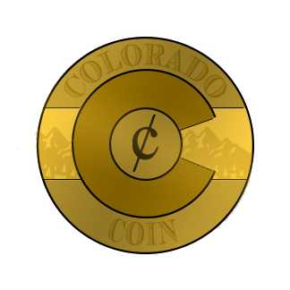

# Colorado Coin (COLO)

An experimental ERC20 token for organizating local communities.  Dogfooded at [Boulder Blockchain](https://www.meetup.com/Boulder-Blockchain/)

# How it works.

ColoradoCoins can be printed, and then affixed with a QR Code that represents the private key (and a small amount of ETH for transfering them) via a [YouveGotETH](https://youvegoteth.github.io) link.

Here's what they look like:

And here's what the 'receive' interface looks like:

# Deployed Addresses

* Mainnet: [0x2941deaad71adb02b944bd38ebce2f1f4c9a62dc](https://etherscan.io/address/0x2941deaad71adb02b944bd38ebce2f1f4c9a62dc)
* Ropsten: [0x2941deaad71adb02b944bd38ebce2f1f4c9a62dc](https://ropsten.etherscan.io/address/0x2941deaad71adb02b944bd38ebce2f1f4c9a62dc)

# Distribution

Right now, there are 100 coins.  As tokens are minted, this read me will be updated.

The distribution as follows is:

* 90 coins: HODL'd by @owocki, planning to distribute at community events.
* 10 coins: distributed to community on 9/6 Boulder Blockchain.

# Legal Stuff

These coins are just given out for fun.  They are never sold for money, fiat or otherwise.

